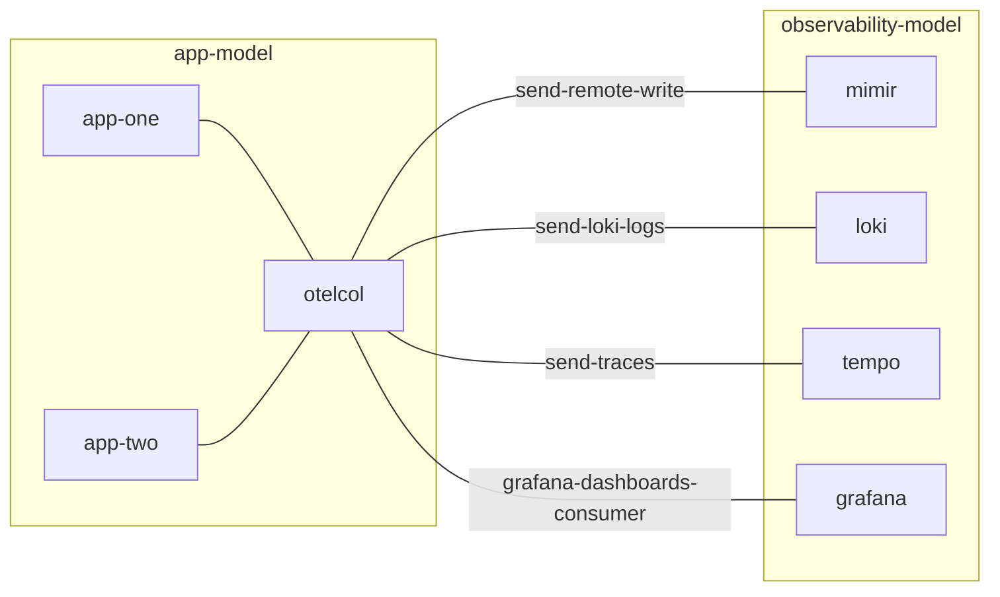

# OpenTelemetry Collector Operator for Kubernetes

[](https://charmhub.io/opentelemetry-collector-k8s)
[](https://github.com/canonical/opentelemetry-collector-k8s-operator/actions/workflows/release.yaml)
[](https://discourse.charmhub.io)

Charmed [OpenTelemetry Collector](https://github.com/open-telemetry/opentelemetry-collector) operator for Kubernetes.


## Design and features

- This charm is written in the reconciler pattern.
- A key design choice for the charm is that all telemetry goes to all exporters. Splitting telemetry can still be accomplished by tiering multiple otelcol apps. 
- The charm uses a custom otelcol distribution, which does not include all of [contrib](https://github.com/open-telemetry/opentelemetry-collector-contrib/).
  Refer to `manifest.yaml` in the [rock repo](https://github.com/canonical/opentelemetry-collector-rock) for included components.


## Usage

```bash
charmcraft pack
juju deploy ./opentelemetry-collector-k8s_ubuntu@24.04-amd64.charm otelcol \
  --resource opentelemetry-collector-image=ubuntu/opentelemetry-collector \
  --queue_size=500 \
  --extra_alert_labels="environment:dev"
```

You can "recreate the world" with a dedicated charm action,

```bash
juju run otelcol/0 reconcile
```


## Sample deployment scenario

In this example, otelcol is a collection agent pushing directly to backends.




## OCI Images

| Workload container | Rock repo                              | Dockerhub                                     |
|--------------------|----------------------------------------|-----------------------------------------------|
| `otelcol`          | [`opentelemetry-collector-rock`][rock] | [`ubuntu/opentelemetry-collector`][dockerhub] |


## Releases

| GitHub branch | Charmhub track | Supported until |
|---------------|----------------|-----------------|
| `track/2`     | `2`            | 2026-07         |


## Related charms

- [opentelemetry-collector](https://github.com/canonical/opentelemetry-collector-operator) (VM charm)
- [grafana-agent-k8s](https://github.com/canonical/grafana-agent-k8s-operator)


## Contributing

Please see the [Juju SDK docs](https://juju.is/docs/sdk) for guidelines on enhancements to this charm following best practice guidelines, and the [contributing](CONTRIBUTING.md) doc for developer guidance.


[rock]: https://github.com/canonical/opentelemetry-collector-rock
[dockerhub]: https://hub.docker.com/r/ubuntu/opentelemetry-collector
