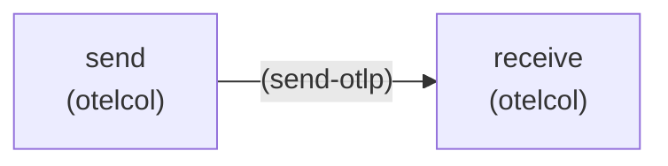

# How JujuTopology labels appear in OTLP telemetry

This document focuses on telemetry labeling in the OTLP data model that is core to the opentelemetry-collector charm's pipelines.

Juju topology labels identify where telemetry comes from in a Juju model:

- `juju_model`
- `juju_model_uuid`
- `juju_application`
- `juju_charm`
- `juju_unit`

This page explains where those labels are injected into the OTLP data model, and where they are expected to already exist.

## Why this matters

OTLP data is often centralized and mixed across many applications and models.
Without topology attributes, logs, metrics, and traces are much harder to filter, route, alert on, and correlate.
Some applications may already have [telemetry labels](https://documentation.ubuntu.com/observability/track-2/explanation/telemetry-labels/), and knowing the structure within the charm's pipelines is important for Juju admin operations like [filtering](https://documentation.ubuntu.com/observability/latest/how-to/selectively-drop-telemetry-otelcol/), [tiering](https://documentation.ubuntu.com/observability/latest/how-to/tiered-otelcols/), and debugging the pipeline with the `debug_exporter_for_X` [config options in the charm](https://charmhub.io/opentelemetry-collector-k8s/configurations?channel=dev/edge).

## Telemetry sources

If OTLP data enters the pipeline with existing labels, they will be preserved, unless overwritten with processors. In other words, it is the responsibility of charm developers to instrument their applications so that Juju topology labels are present. This is often abstracted by charm libraries which do this internally. For self-monitoring of the collector itself, the `receivers`/`exporters` in the config file are instrumented with the charm's own topology.

## Logs

### Labels in the OTLP data model

```json
{
  "resourceLogs": [
    {
      "resource": {
        "attributes": [
          {"key": "juju_model", "value": {"stringValue": "<model>"}},
          {"key": "juju_model_uuid", "value": {"stringValue": "<uuid>"}},
          {"key": "juju_application", "value": {"stringValue": "<application>"}},
          {"key": "juju_unit", "value": {"stringValue": "<unit>"}},
          {"key": "juju_charm", "value": {"stringValue": "<charm>"}}
        ]
      },
      "scopeLogs": [
        {
          "logRecords": [
            {
              "body": {"stringValue": "<log line>"}
            }
          ]
        }
      ]
    }
  ]
}
```

### Logs in the Grafana UI

`[LOGS_SCREENSHOT_PLACEHOLDER]`

## Metrics

For collector self-monitoring metrics, the charm explicitly configures scrape labels with Juju topology (`add_self_scrape(...)`).
Those labels are then attached to scraped metric series.

For incoming OTLP metrics from related workloads, the collector forwards the OTLP metric payload selected via the OTLP relation endpoint. In that flow, topology is expected to already be present in OTLP resource attributes from the sender side.

### Labeled metrics in the OTLP data model

```json
{
  "resourceMetrics": [
    {
      "resource": {
        "attributes": [
          {"key": "juju_model", "value": {"stringValue": "<model>"}},
          {"key": "juju_application", "value": {"stringValue": "<application>"}},
          {"key": "juju_unit", "value": {"stringValue": "<unit>"}}
        ]
      },
      "scopeMetrics": [
        {
          "metrics": [
            {
              "name": "<metric_name>"
            }
          ]
        }
      ]
    }
  ]
}
```

### Metrics in the Grafana UI

`[METRICS_SCREENSHOT_PLACEHOLDER]`

## Traces: where topology belongs

Trace ingestion/forwarding in this charm is configured through tracing integrations and OTLP HTTP exporters for Tempo paths.

For traces, Juju topology should be represented in OTLP resource attributes (typically on the ResourceSpans). The collector pipeline forwards that context so traces can be filtered and correlated by source in the backend.

### Labeled spans in the OTLP data model

```json
{
  "resourceSpans": [
    {
      "resource": {
        "attributes": [
          {"key": "juju_model", "value": {"stringValue": "<model>"}},
          {"key": "juju_application", "value": {"stringValue": "<application>"}},
          {"key": "juju_unit", "value": {"stringValue": "<unit>"}}
        ]
      },
      "scopeSpans": [
        {
          "spans": [
            {
              "name": "<span_name>"
            }
          ]
        }
      ]
    }
  ]
}
```

### Traces in the Grafana UI

`[TRACES_SCREENSHOT_PLACEHOLDER]`

## Rules: injecting requirer topology

Although, this is technically not a concern of the opentelemetry-collector pipeline, rules are core to the [OTLP charm library](https://github.com/canonical/charmlibs/tree/main/interfaces/otlp) which injects the requirer's Juju topology into the rules. This enables downstream systems to keep alerting/rule scope aligned with the same origin metadata as telemetry. For example, the labeled rules indicate that they are specific to the `send` (`opentelemetry-collector-k8s`) application:



```yaml
groups:
- name: rules_faf8c6cc_send_Both_alerts
  rules:
  - alert: Alerting
    expr: (count_over_time({job=~".+", juju_application="send", juju_model="rules",
      juju_model_uuid="faf8c6cc-698e-4c9a-8c14-f5dec651cd62", juju_charm="opentelemetry-collector-k8s"}[30s])
      > 100)
    labels:
      juju_application: send
      juju_charm: opentelemetry-collector-k8s
      juju_model: rules
      juju_model_uuid: faf8c6cc-698e-4c9a-8c14-f5dec651cd62
      juju_unit: send/0
      severity: high
```

## Practical takeaway

When validating topology end-to-end, check these layers separately:

1. relation data: topology metadata and rules are published
2. collector config: signal pipelines include expected processors/exporters and label hints
3. backend payload/index: OTLP resource attributes (and Loki labels for logs) contain `juju_*` keys
